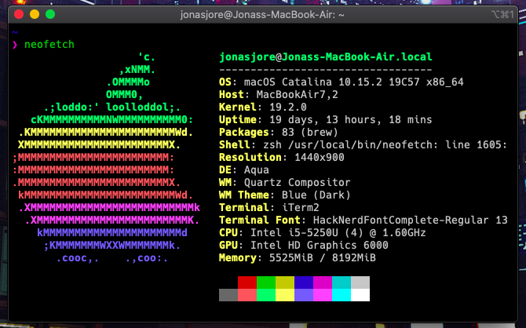

# Uses

## Inspired by [uses.tech](uses.tech) by Wes Bos

This file serves as a reference of what tools and gear i use for work and for private.
I hope this reference file can be of use to other developers or for someone that needs a changeup of they're own gear list.

### Development tools
* Terminal emulator: Iterm 2
* Terminal shell: ZSH. [zsh config](https://github.com/JonasJore/dotfiles/blob/master/.zshrc)
* Code editor: VS Code
* IDE: IntelliJ
* Browser: Firefox
* Favorite coding font: Firacode with ligatures

### Office Setup
* Self-built PC specs:
  * Case: NZXT H510 Black edition
  * CPU: Intel Core i7 9700k
  * MotherBoard: ASUS ROG Strix Z390-F
  * GPU: Asus GeForce RTX 2070 SUPER
  * Main SSD: Samsung 970 EVO Plus 1TB
  * Secondary SSD: Samsung 860 QVO 1TB
  * RAM: HyperX Fury RGB DDR4 2666MHz 16GB
  * OS: Windows 10 (Planning to setup dualboot with Linux)
* Keyboard: Cooler Master MasterKeys Pro S (Cherry MX Brown)
* Mouse: Razer DeathAdder Chroma 2015
* Monitor: [Samsung 28" UE570D 4K LED FreeSync](https://www.samsung.com/no/monitors/uhd-ue570/)

### Gear
* Laptop: Apple Macbook Air 2016 (Current)
* Phone: Sony Xperia 1
* Headphones: Sony WH-1000-XM3

#### Apple Macbook Air 2016 System Specs:
